PLATFORM ART STYLE PERSPECTIVE ASPECT RATIO COUNTRY GENRES
Desktop [Legacy] Pixel Art (16-Bit) ▾ Top-Down ▾ Landscape 16:9 United States Role Playing

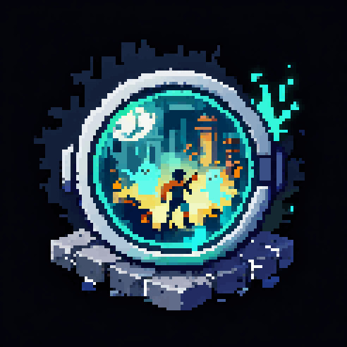

# Echoes of the Vale

Uncover the secrets of a forgotten land where memories refuse to fade. In a world shaped by lingering echoes of the past,
players explore ancient ruins, uncover lost histories, and restore balance to a fractured Vale.
Core Loop:Players explore diverse regions of the Vale, uncover hidden ruins, and interact with Echoes—manifestations of past
events—to alter the environment, solve puzzles, and overcome enemies. By activating Echo points, players reveal fragments of
history that influence the present world.
Setting: The Vale is a once-thriving land now scattered with the remnants of a lost civilization. Each region—lush grasslands,
overgrown swamps, sun-scorched deserts, deep caverns, and frozen wastes—contains ancient ruins where memories linger as
visible and interactive Echoes.
Key Innovation: The Echo System allows players to perceive and interact with lingering memories of the past. Players can
temporarily reveal or influence past states of the world—restoring broken paths, uncovering hidden structures, or triggering
events that reshape the present.
Progression: Players restore the Vale by uncovering key Echoes across regions, unlocking new abilities tied to memory and
resonance. As they progress, they gain deeper insight into the past, access new areas, and gradually piece together the truth
behind the Vale’s collapse.

### Concept Art

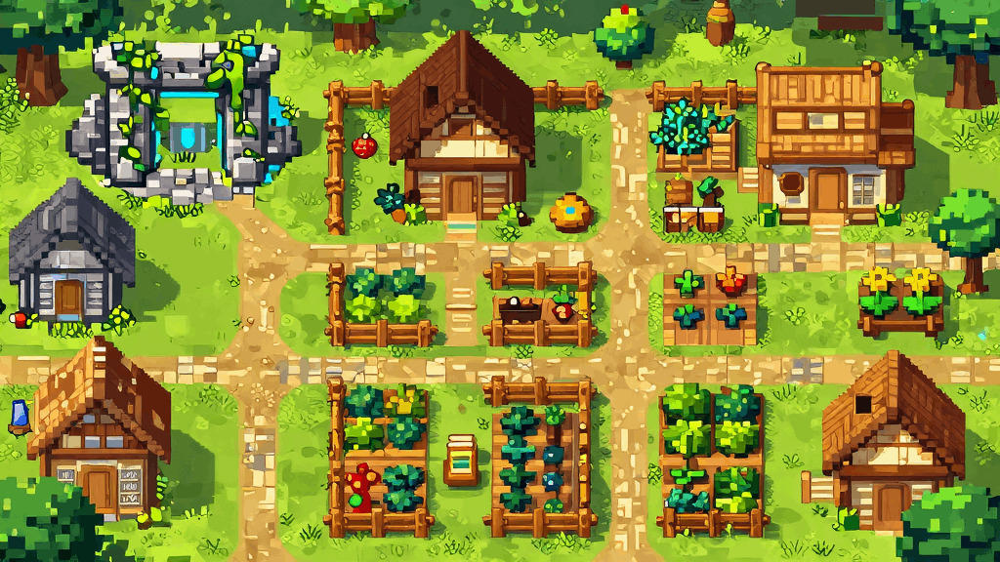

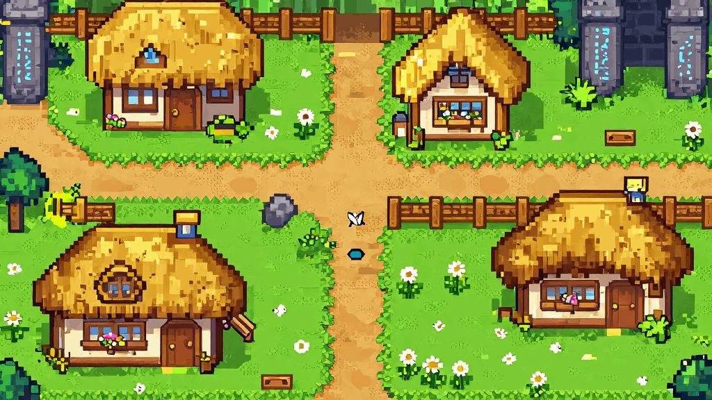

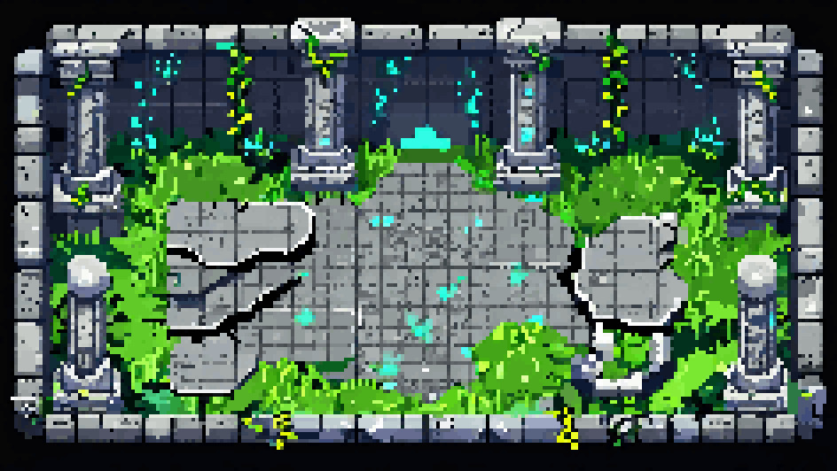

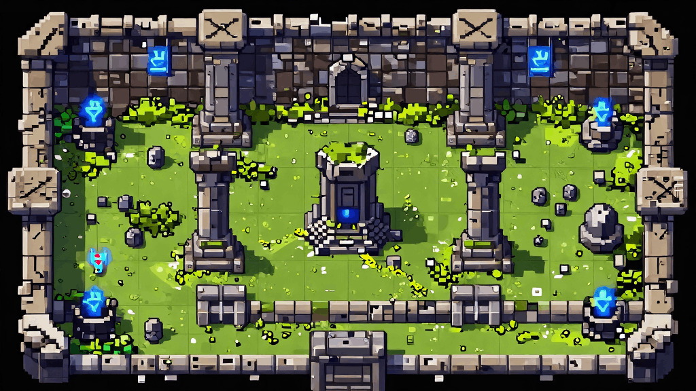

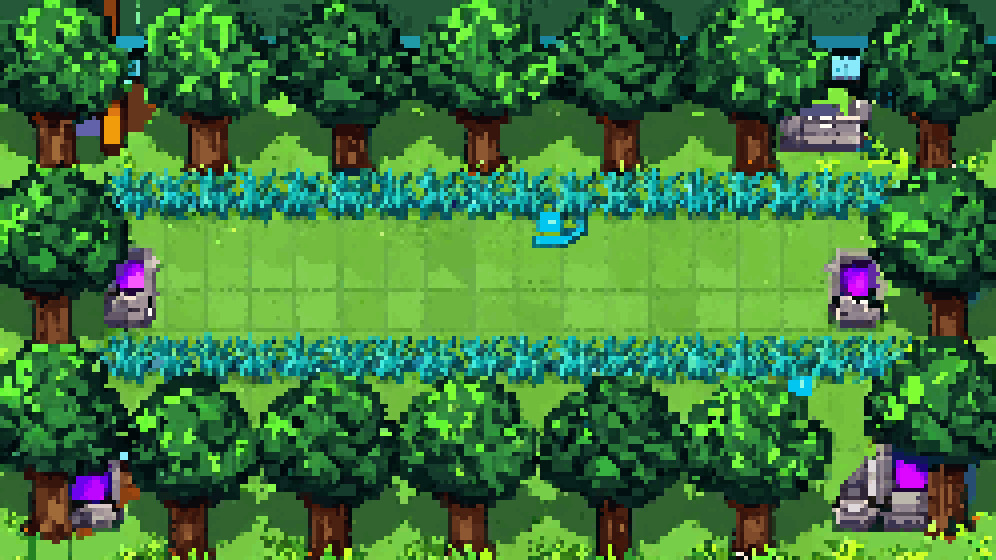

## Mechanics

### Echo Tracing (Harmonic Echo-Tracing)

Players attune to lingering memories within the Vale, capturing a fragment of their recent actions to create an Echo—a spectral
imprint that reenacts those actions in the present world.
Core Function: At specific Echo Points, players can record a short sequence of movement and interactions. This memory is then
replayed as an Echo, allowing the player to act alongside their past self.

**Strategic Purpose: Echoes enable players to:**
●
Activate multiple mechanisms at once
●
Solve spatial and timing-based puzzles
●
Navigate environments that require presence in multiple places
●
Outsmart enemies using coordinated actions

**Key Details:**

●

**Echoes interact with Memory Objects**

Echoes can affect specific objects tied to the Vale’s past (bridges, switches, platforms, ancient mechanisms).
●

**Limited Duration & Capacity**

The length and number of active Echoes are tied to the player’s Echo Attunement (your upgrade system).
●

**Echo Instability**

If disrupted (by enemies or hazards), the Echo collapses—causing feedback that briefly weakens or disorients the player.

### Echo Attunement

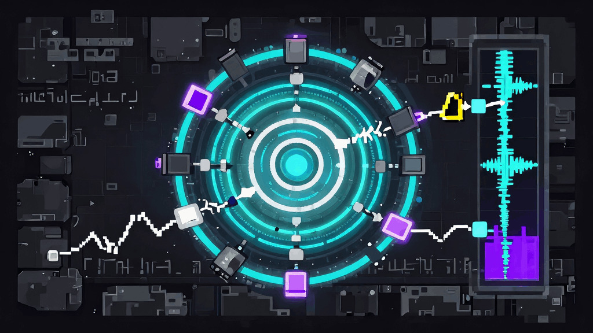

### Echo Attunement

As Soren explores the Vale, he grows more attuned to its lingering memories. By uncovering Echoes and restoring fragments of
the past, he strengthens his connection to the Echo Lens—unlocking new abilities and deepening his control over memory itself.

### Core Concept

Progression is tied to discovering and restoring Echoes, not collecting abstract resources.
Each major Echo Site or memory fragment contributes to Soren’s Attunement, gradually expanding what he can do with Echo
Tracing.

### Mechanism

●
Players uncover Memory Fragments throughout the world
●

**These fragments are tied to:**
◯
ruins
◯
important locations
◯
story events (especially tied to Eryn 👀)
●
At key locations (or automatically), these fragments enhance the Echo Lens, unlocking new capabilities

### Player Benefits (Upgrades)

**Progression directly enhances your core mechanic:**
●

**Extended Echo Duration**

Increase how long an Echo can replay actions
●

**Multiple Echoes**

Create and maintain multiple Echoes at once
●

**Echo Interaction Strength**

**Allow Echoes to:**
◯
move heavier objects
◯
trigger stronger mechanisms
●

**Echo Stability**

Reduce collapse when disrupted by enemies or hazards

### Advanced Abilities (Mid–Late Game)

●

**Echo Persistence**

Echoes remain active longer or until manually dismissed
●

**Echo Recall**

Replay previous recordings without re-recording
●

**Echo Layer Awareness**

See hidden Echo objects without activating a full Echo state

### Gameplay Impact

**Progression transforms Soren from:**
●
someone who can barely interact with Echoes

**into:**
●
someone who can reshape environments, solve complex puzzles, and manipulate multiple layers of the world at once

**This allows for:**
●
more complex puzzle design
●
multi-step interactions
●
larger, more interconnected environments

### Restoring the Vale

### Primary Objective

Restore the memories of the Vale and uncover the truth behind its silence.
Players guide Soren, a Seeker of Echoes, across the Vale to reactivate dormant Echo Sites, recover lost Memory Fragments, and
resist the spread of the Hush. Through exploration and Echo interaction, players gradually piece together the events that led to
the Vale’s sealing and determine its ultimate fate.

### Core Gameplay Objectives

**These define what the player is constantly doing:**
●
Explore environments to discover ruins, Echo Sites, and hidden paths
●
Use Echo Tracing to solve environmental puzzles
●
Activate Echo Sites to restore fragments of the past
●
Avoid or overcome environmental hazards and enemies
●
Progress deeper into each region by unlocking new paths

### Short-Term Objectives (Moment-to-Moment)

**These guide the player during active gameplay:**
●
Reach and activate nearby Echo Points
●
Record and replay Echoes to interact with objects
●
Solve puzzles involving timing, positioning, and multi-step actions
●
Navigate obstacles using both the present and Echoed past
●
Safely traverse areas affected by the Hush

### Mid-Term Objectives (Per Area / Region)

**These structure progression within each biome:**
●
Locate key ruins or landmarks within the region
●
Restore major Echo Sites tied to the area’s history
●
Unlock new abilities or improvements to Echo Attunement
●
Clear paths blocked by environmental puzzles or Hush corruption
●
Discover Memory Fragments tied to Eryn’s journey

### Long-Term Objectives (Game Progression)

**These define overall progression across the game:**
●
Fully restore the Vale’s major regions
●
Strengthen the Echo Lens through accumulated Attunement
●
Uncover the full story behind the Vale and the Hush
●
Follow the remnants of Eryn’s path and uncover her fate
●
Reach the heart of the Vale where memory and silence converge

### Optional Objectives (Exploration & Completion)

**These add depth for players who want more:**
●
Find hidden Echo Sites and secret areas
●
Collect all Memory Fragments in each region
●
Discover optional lore tied to the Vale’s past inhabitants
●
Solve advanced or hidden puzzles requiring deeper Echo mastery

### Echoes in Motion

### Overview

In Echoes of the Vale, players control Soren, a Seeker of Echoes, exploring a world where memories linger as interactive
remnants of the past. By using the Echo Lens, players record and replay their actions to solve puzzles, traverse environments,
and uncover the Vale’s forgotten history.

### Basic Controls

●
Move – Navigate Soren through the world
●
Interact – Activate objects, Echo Points, and mechanisms
●
Record Echo – Begin recording Soren’s actions at an Echo Point
●
Play Echo – Replay recorded actions as an Echo
●
Cancel / Reset – Stop playback or clear current Echo

### Core Gameplay Loop

1. Explore
Travel through the Vale to discover ruins, Echo Sites, and hidden paths
2. Observe
Identify environmental obstacles and puzzle elements
3. Record
Capture a sequence of actions using the Echo Lens
4. Replay
Use the Echo to perform actions alongside Soren
5. Progress
Solve puzzles, unlock paths, and advance deeper into the world

### Using Echo Tracing

Echo Tracing is the core mechanic of the game.

### Recording

●
Stand at an Echo Point
●
Activate recording
●
Perform a sequence of actions (movement, interactions)

### Playback

●
The recorded actions are replayed as an Echo
●
The Echo repeats those actions exactly
●
Soren can move freely while the Echo is active

### Solving Puzzles

Puzzles are based on using Echoes to interact with the environment.

**Common puzzle interactions include:**
●
Holding down pressure plates
●
Activating multiple switches at once
●
Timing movements between Soren and the Echo
●
Accessing areas that require presence in two places

### Exploration

●
Each region contains ruins, hidden paths, and optional areas
●
Echoes may reveal paths that do not exist in the present
●
Careful observation is rewarded

### Hazards & Enemies

●
Environmental hazards may disrupt or destroy Echoes
●
The Hush consumes parts of the world and removes Echo interactions
●
Enemies may block paths or interfere with puzzle execution

### Progression

●
Discover Memory Fragments to strengthen your Echo abilities
●

**Unlock new capabilities such as:**
◯
Longer Echo duration
◯
Multiple Echoes
◯
Stronger interactions

### Goal

Restore the Vale’s lost memories, uncover the truth behind the Hush, and determine the fate of a world caught between
remembrance and silence.

### Structure of the Vale

The Vale is divided into interconnected regions, each containing a mix of open exploration areas, structured puzzle spaces, and
deeper ruins. Progression is semi-linear, with each region introducing new mechanics, increasing complexity, and expanding the
player’s understanding of Echo interaction.
Players begin in a safe, grounded environment before gradually venturing into more dangerous and memory-rich areas of the
Vale.

### Level Flow Overview

**Each region follows a consistent structure:**
1. Entry Area
◯
Introduces the biome and its visual identity
◯
Light exploration and minimal danger
2. Exploration Zone
◯
Open space with branching paths
◯
Basic puzzles and optional discoveries
3. Echo Site / Puzzle Core
◯
Central mechanic-focused challenge
◯
Requires use of Echo Tracing
4. Unlock / Transition
◯
Opens new paths or abilities
◯
Leads to the next area or region

### Starting Area: Grassland Village

The game begins in a quiet village surrounded by open grasslands and scattered ruins. This area serves as the player’s
introduction to movement, interaction, and the fundamentals of the Echo system.

**Purpose:**

●
Establish tone and atmosphere
●
Teach basic controls and interaction
●
Introduce the concept of Echoes in a safe environment

**Key Elements:**

●
Friendly, low-risk environment
●
First visible Echo phenomenon
●
Subtle guidance toward the first ruin

### First Ruin: Echo Initiation Site

Located just outside the village, this small ruin acts as the player’s first real interaction with Echo mechanics.

**Purpose:**

●
Introduce Echo Recording and Playback
●
Deliver the first “aha” puzzle moment

**Example Flow:**

●
Player encounters a blocked path (door or gate)
●
Discovers an Echo Point
●
Records an action (standing on a pressure plate)
●
Replays the Echo to maintain the action
●
Player progresses past the obstacle

### Region Progression

As players move beyond the starting area, each region builds on previous mechanics:
- Grasslands
●
Introductory puzzles
●
Basic Echo interactions
●
Minimal Hush presence
- Ancient Forest
●
Hidden paths revealed by Echoes
●
Increased puzzle complexity
●
Ambush-style enemies
- Swamp
●
Slower movement and environmental hazards
●
Corrupted Echo Sites
●
Stronger Hush influence
- Desert
●
Large open areas with buried ruins
●
Multi-step puzzles
●
Increased emphasis on exploration
- Caverns
●
Navigation-focused design
●
Limited visibility
●
Echo-based pathfinding
- Highlands
●
Vertical traversal and positioning puzzles
●
More dangerous enemies
●
Complex multi-layer Echo interactions
- Winter Lands
●
Late-game region
●
Strong Echo presence
●
Major story revelations

### Puzzle Design Progression

Levels are designed to gradually teach and expand on mechanics:
●

**Early Game:**

Single-step Echo puzzles
●

**Mid Game:**

Multi-step and timing-based puzzles
●

**Late Game:**

Multi-Echo coordination and layered challenges

### Level Connectivity

●
Regions are connected through natural transitions (paths, ruins, tunnels)
●
Previously visited areas may unlock new paths with upgraded abilities
●
Optional areas and secrets reward exploration

### The Laws of the Vale

The world of Echoes of the Valeoperates on consistent, predictable systems that govern how Echoes, the environment, and the
player interact. These rules ensure that all puzzles and challenges are logical, fair, and learnable.

### Core Player Rules

●
Soren can move freely in all directions
●
Soren can interact with objects, NPCs, and Echo Points
●
Only one primary interaction can occur at a time
●
Player actions can be recorded as Echoes

### Echo Rules (Core Mechanic)

### Recording

●
The player can record actions at designated Echo Points
●

**Recording captures:**
◯
Movement
◯
Interactions
◯
Timing
●
Recording duration may be limited depending on progression

### Playback

●
Echoes replay recorded actions exactly as performed
●
Echoes do not adapt or react to new conditions
●
Echoes follow the same path and timing every time

### Limitations

●
Only a limited number of Echoes can exist at once
●
Echoes disappear after completing their sequence
●
Echoes cannot create new Echoes

### Interaction Rules

●

**Echoes can:**
◯
Trigger pressure plates
◯
Activate switches
◯
Block or redirect hazards
●

**Echoes cannot:**
◯
Pick up items (unless designed later as an upgrade)
◯
Interact with NPC dialogue
◯
Override player control

### Environment Rules

●
Objects behave consistently whether interacted with by the player or an Echo
●

**Environmental elements reset when:**
◯
The player leaves the area
◯
The player is defeated
◯
A puzzle is manually reset

### Puzzle Rules

●
Every puzzle has at least one clear solution
●

**Solutions rely on timing, positioning, or sequencing**

●
Puzzles introduce new mechanics gradually
●
Previously learned mechanics are reused and combined

### Checkpoint Rules (Echo Sites)

●

**Echo Sites act as:**
◯
Save points
◯
Respawn locations
◯
Echo recording anchors
●
Activating an Echo Site updates the player’s respawn point

### Defeat Rules

●

**On defeat:**
◯
The player returns to the last activated Echo Site
◯
Active Echoes are cleared
◯
Puzzle states reset

### Hush Rules (Advanced Mechanic)

●
The Hush disrupts Echo stability
●

**In Hush zones:**
◯
Echo duration may be reduced
◯
Echoes may become unstable or fail
●
Prolonged exposure leads to defeat

### Progression Rules

●
New abilities expand how Echoes can be used
●
Previously inaccessible areas become reachable
●
Difficulty increases through mechanic layering, not randomness

### Consistency Principle (VERY IMPORTANT)

If something works once, it should always work the same way.
●
No hidden rules
●
No unpredictable behavior
●
Players succeed through understanding, not guessing

### A Quiet Beginning

The game begins in a peaceful grassland village on the edge of the Vale. The environment is calm, with soft ambient sounds,
subtle movement in the grass, and a sense of stillness. Nothing immediately feels wrong—but something feels… off.
Soren stands near the edge of the village, facing inward toward the main path.

### Player Control Introduction

The player is given control immediately.

**Purpose:**

●
Teach basic movement
●
Allow free exploration in a safe environment

**What the player can do:**

●
Walk around the village
●
Interact with simple objects
●
Talk to a small number of NPCs

### Subtle Foreshadowing

As the player explores, small details hint that the Vale is not normal:
●
A faint shimmer near the well
●
A soft whisper carried on the wind
●
An object that flickers briefly before returning to normal

**NPC dialogue may include:**
“Have you noticed… things don’t feel quite right lately?”

### First Objective Trigger

The player is naturally guided toward a central point in the village (such as a well or small ruin fragment).

**When interacting with it:**
- The player experiences their first Echo event

### First Echo Moment

●
The screen subtly shifts
●
A faint, glowing silhouette appears briefly
●
The environment flickers between present and past
This moment is short and controlled.

**Purpose:**

●
Introduce the concept of Echoes
●
Create curiosity and mystery
●
Establish the tone of the game

### Direction to First Ruin

**After the first Echo event:**
●
An NPC or subtle environmental cue directs the player toward nearby ruins outside the village
●
The path is visible but not explicitly forced

### Transition to Gameplay

The player leaves the village and enters the surrounding grasslands.

**Here they encounter:**
●
Light environmental obstacles
●
Their first simple puzzle setup
●
The first true Echo Point

### First Mechanic Introduction

**At the first ruin:**
●
The player is introduced to Echo Recording and Playback
●

**A simple puzzle teaches the mechanic:**

**Example:**

●
A pressure plate opens a door
●
The door closes when the player steps off
●
The player records themselves standing on the plate
●
The Echo holds the plate while the player moves forward
- This creates the first “aha” moment

### End of Opening Sequence

**Once the player solves the first puzzle:**
●
A path opens deeper into the Vale
●
The player gains their first sense of progression
●
The game transitions into full exploration mode

### Echoes of Restoration

Rewards in Echoes of the Valeare centered around discovery, memory, and progression rather than traditional loot. Players are
rewarded for exploration, puzzle-solving, and restoring fragments of the past.

### Primary Rewards

- Memory Fragments
The core reward of the game.
●
Found in ruins, Echo Sites, and hidden areas
●
Represent preserved pieces of the Vale’s history
●
Used to increase Echo Attunement
●
Unlock new abilities and strengthen Echo mechanics
- Echo Abilities
Unlocked through progression and key discoveries.

**Examples include:**
●
Longer Echo duration
●
Multiple active Echoes
●
Stronger interaction with objects
●
Improved Echo stability
These directly expand gameplay possibilities and puzzle complexity.

### Exploration Rewards

- Hidden Echo Sites
●
Optional locations containing additional Memory Fragments
●
Often require deeper understanding of mechanics to access
- Secret Areas
●
Hidden paths revealed through Echo interaction
●
May contain rare fragments or unique environmental storytelling

### Narrative Rewards

- Echo Memories
●
Short glimpses into the past
●
Reveal events tied to the Vale’s fall
●
Often connected to Eryn’s journey
- Lore Discoveries
●
Environmental storytelling
●
Optional details about the Vale’s history and inhabitants
●
Adds depth without blocking progression

### Progression Rewards

- New Paths & Access
●
Unlock previously inaccessible areas
●
Reveal shortcuts or alternate routes
●
Expand the explorable world
- Restored Environments
●
Areas visually and functionally improve as Echoes are restored
●
Reinforces player impact on the world

### Optional Completion Rewards

**For players who explore everything:**
●
Fully restored regions
●
Additional lore or hidden story elements
●
Access to optional late-game challenges

### Echoes Grow Stronger

Difficulty in Echoes of the Valeincreases through the player’s growing mastery of Echo abilities, environmental complexity, and
the influence of the Hush. The game gradually introduces new mechanics and layers them together to create deeper, more
challenging interactions.

### Early Game (Grasslands & Village Outskirts)

**Focus: Learning the Basics**

●
Simple puzzles with a single solution
●

**Introduction to:**
◯
Movement
◯
Interaction
◯
Basic Echo recording/playback
●
Minimal or no enemy pressure

**Puzzle Examples:**

●
Pressure plates
●
Simple timing with one Echo
●
Basic path unlocking
- Goal:

**Teach the player what Echoes are and how they work**

### Mid Game (Ruins, Forests, Expanding Vale)

**Focus: Combining Mechanics**

●
Multiple Echo interactions required
●

**Introduction of:**
◯
Timing-based puzzles
◯
Limited Echo duration
◯
Environmental hazards
●
Light enemy presence begins

**New Challenges:**

●
Managing multiple actions across time
●
Navigating hazards while using Echoes
●
Maintaining positioning and awareness
- Goal:

**Encourage players to think ahead and plan sequences**

### Late Game (Corrupted Zones & Deep Vale)

**Focus: Mastery & Pressure**

●
Complex multi-step puzzles
●

**Overlapping mechanics:**
◯
Echo + hazards + enemies
●
Introduction of Hush Zones that interfere with abilities

**New Challenges:**

●
Limited safe spaces
●
Echo instability
●
Faster decision-making
- Goal:

**Test the player’s mastery of all mechanics under pressure**

### Endgame (Core of the Vale)

**Focus: Precision & Understanding**

●
High-complexity puzzles requiring full mechanic usage
●
Minimal guidance
●
Heavy Hush influence

**Design Approach:**

●
Fewer but more meaningful challenges
●
Strong narrative integration
●
Emotionally impactful encounters
- Goal:

**Deliver a culmination of everything learned**

### Progression Through Mechanics (Key Layering)

Instead of just making things “harder,” difficulty increases by layering mechanics:
1. Learn Echo
2. Use Echo with movement
3. Use Echo with timing
4. Use Echo with hazards
5. Use Echo with enemies
6. Use Echo under Hush interference
- This keeps difficulty fair and readable

### Optional Exploration Difficulty

●

**Side areas offer:**
◯
Harder puzzles earlier
◯
Hidden Memory Fragments
●
Designed for players who want extra challenge

### Failure-Friendly Design

●
Frequent checkpoints (Echo Sites)
●
Quick recovery after defeat
●
Encourages experimentation without frustration

### Fading Echoes

Defeat in Echoes of the Valerepresents a temporary loss of connection to the Vale’s memories rather than a traditional “game
over.” When Soren is overwhelmed—by enemies, environmental hazards, or the Hush—his Echo attunement destabilizes, causing
his connection to the world’s memories to fade.

### Defeat Triggers

**Soren can be defeated when:**
●
Taking too much damage from enemies
●
Remaining too long within areas consumed by the Hush
●
Failing critical environmental interactions (e.g., falling into hazards)

### On Defeat

**When defeat occurs:**
●
The screen desaturates and fades
●
Echo effects collapse and dissolve
●
Soren reappears at the last activated Echo Site or safe location

### Consequences

Defeat is designed to be low frustration, high tension.
●
Players are returned to a nearby checkpoint
●
Progress within the current puzzle or area may reset
●
Active Echo recordings are cleared
●
No major loss of progression or collected Memory Fragments

### Echo Disruption

Before full defeat, Soren may experience partial disruption:
●
Echoes become unstable or collapse
●
Abilities may temporarily weaken
●
Visual distortion indicates loss of attunement
This creates tension without immediately punishing the player.

### The Role of the Hush

**The Hush introduces a unique form of danger:**
●
It destabilizes Echoes more quickly
●
It may prevent Echo usage entirely in certain areas
●
Prolonged exposure leads to rapid defeat
The Hush reinforces the idea that defeat is tied to erasure and loss of memory, not physical damage alone.

## Game World

### The Vale That Remembers

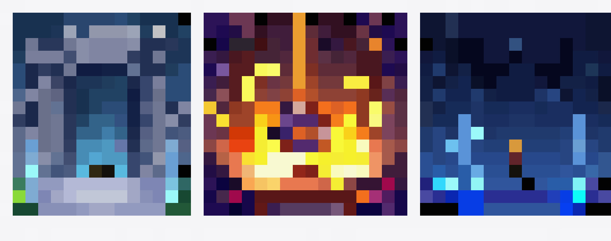

In a forgotten corner of the world lies the Vale—a land where memories linger long after those who lived them are gone. Here,
the past is not lost… it echoes.
Soren, a lone Seeker of Echoes, arrives at the edge of a quiet grassland village—the last refuge untouched by the strange
remnants scattered across the land. Beyond its borders, ancient ruins pulse faintly with lingering memories, where fragments of
history manifest as shimmering, spectral Echoes.
Armed with a mysterious Echo Lens, Soren begins to uncover these remnants—reliving moments long buried and shaping the
present through the past. Bridges reform, doors reopen, and forgotten paths reveal themselves as the Vale slowly begins to
remember what it once was.
As Soren ventures deeper, he awakens dormant Echo Sites—ancient places where memories are strongest. With each activation,
the Vale stirs… but something else stirs with it.
A distant voice, known only as The Archivist, speaks through the echoes, guiding—and warning—him. The Vale was not
abandoned… it was silenced. Not by war, but by a choice.
A creeping force known as the Hush—a presence that erases memory itself—begins to spread, consuming Echoes and leaving
behind empty, lifeless remnants. Where it passes, even the past is forgotten.
Soren must journey across the Vale’s regions—from overgrown grasslands and crumbling village ruins, to sunken sanctuaries,
ancient forests, and buried temples—using Echo Tracing to uncover what was lost and resist the spreading silence.

**Along the way, he discovers the truth:**
The Vale did not fall—it was sealed away, its memories preserved to prevent something worse from escaping.

### The Choice

At the heart of the Vale lies the source of its memory—an ancient Echo that binds past and present together.

**Soren must decide:**
●
Restore the Vale’s memories, allowing history to fully return—risking the release of what was once contained
●
Preserve the silence, keeping the Vale frozen and safe—but forever incomplete

### Soren, Keeper of Echoes

Soren is the last known Keeper capable of interacting with the Vale’s lost memories. Through the use of an ancient device known
as the Echo-Lens, he can record and replay fragments of time, restoring pathways, solving puzzles, and uncovering the truth
behind the world’s collapse.

### Core Identity

●
A quiet, observant traveler drawn to the Vale
●
One of the few capable of perceiving lingering Echoes
●

**Acts as both a restorer of memory and a conduit of the past**

### Primary Abilities

- Echo Recording
●
Capture player actions in real time
●
Record movement, timing, and interactions
●
Limited duration early on, expandable through progression
- Echo Playback
●
Replay recorded actions as autonomous Echoes
●

**Used to:**
◯
Activate switches
◯
Solve timing-based puzzles
◯
Interact with the environment simultaneously
- Echo Awareness
●
Detect hidden or inactive Echo Points
●
Reveal memory traces embedded in the environment
●
Provides subtle guidance without explicit UI

### Progression & Growth

**As Soren restores the Vale:**
●
Echo duration increases
●
Multiple Echoes can exist simultaneously
●
New interaction types unlock (e.g., stronger environmental influence)

### Limitations

●
Cannot directly interact with multiple objects at once without Echoes
●
Echoes follow fixed behavior and do not adapt
●
Vulnerable to the Hush, which disrupts Echo abilities

### Visual & Thematic Design

●
Subtle glow/emission tied to Echo usage
●
Effects intensify as abilities grow stronger
●
Visual feedback reflects connection (or disconnection) from the Vale

### Future Expansion (Optional)

●
Additional playable characters with unique Echo variations
●
Ability modifiers that change how Echoes behave
●
Cooperative or alternate timeline interactions

### The Living Memory of the Vale

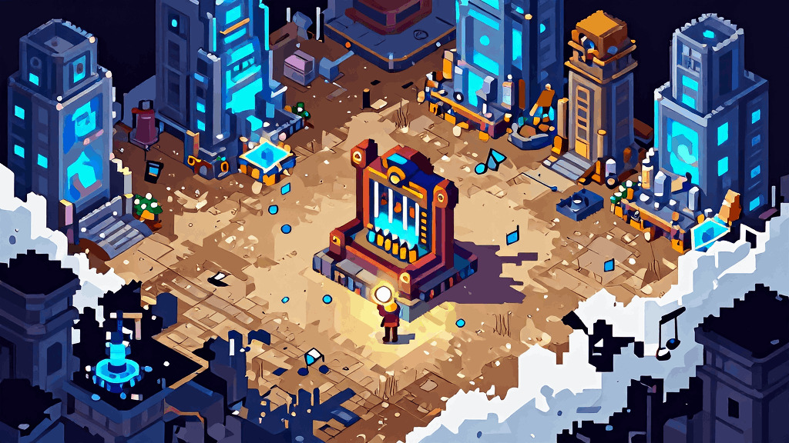

The Vale is a land shaped not only by time—but by memory itself.
Across rolling grasslands, ancient forests, and forgotten ruins, fragments of the past linger as visible Echoes. These are not
illusions, but remnants of lived moments—faint impressions of history that have refused to fade. A broken bridge may briefly
stand whole, a sealed door may remember being open, and footsteps long gone may still echo across the land.
Yet the Vale is changing.
Where Echoes once shimmered gently, a creeping silence now spreads. Known only as the Hush, it consumes memory itself—
leaving behind hollow spaces where even the past cannot be recalled. Entire ruins are reduced to lifeless stone, stripped of
meaning, as if they never existed at all.

### Core Pillars

- Memory as Substance
In the Vale, memory holds weight.
Certain places—Echo Sites—preserve fragments of the past that can be revealed and interacted with. Through the Echo Lens,
players bring these memories into the present, restoring paths, activating ancient mechanisms, and uncovering hidden truths.
- Layered Reality

**The world exists in two overlapping states:**
●
The Present — quiet, weathered, and incomplete
●
The Echoed Past — vibrant, fleeting, and interactive
Players shift between these states through Echo interaction, allowing them to bridge gaps between what was and what remains.
- The Encroaching Silence
The Vale’s greatest threat is not destruction—but erasure.
The Hush spreads like a void, consuming Echoes and stripping the world of its memory. Where it takes hold, puzzles collapse,
paths vanish, and history is lost entirely. Players must push back against this force by restoring Echoes and preserving what
remains of the past.

### The Regions of the Vale

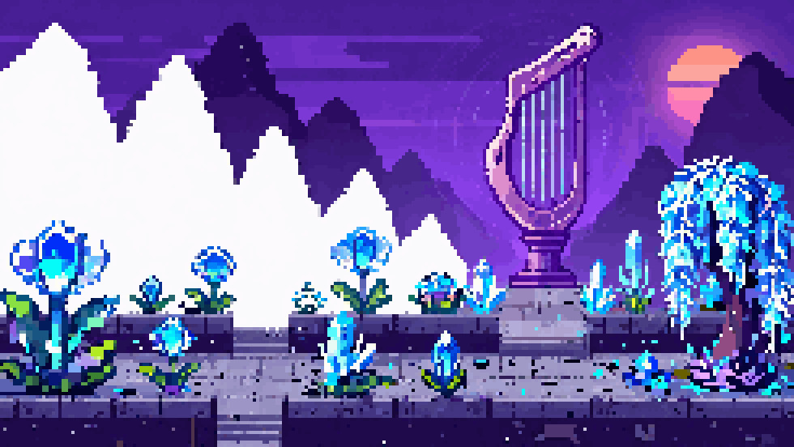

The Vale is divided into distinct natural regions, each shaped by the remnants of the past. Though time has weathered these
lands, memories still linger within their ruins, pathways, and forgotten sanctuaries. Every biome carries its own visual identity,
enemies, environmental hazards, and Echo phenomena.

### Grasslands

The starting region of the game, the grasslands are bright, calm, and deceptively peaceful. Gentle hills, scattered trees, village
paths, and crumbling roadside ruins define the landscape. This is where Soren first encounters the Echoes and begins uncovering
the truth of the Vale.

**Key Features:**

●
Starting village and surrounding fields
●
Small ruins and early Echo Sites
●
Light enemy encounters
●
Introductory puzzles and exploration

### Ancient Forest

Dense woods overgrown with roots, moss, and forgotten stonework. Remnants of old shrines lie hidden beneath foliage, and
Echoes in this region often reveal overgrown paths, vanished guardians, and memories of rituals once performed beneath the
canopy.

**Key Features:**

●
Hidden paths revealed through Echoes
●
Nature-based ruins and shrines
●
Increased puzzle complexity
●
Ambush-style enemies and environmental obstacles

### Swamp

A decayed and heavy region where shallow waters, twisted trees, and half-sunken ruins dominate the land. Echoes here may
reveal when the swamp was once a sacred wetland rather than a place of rot. Visibility is lower, movement is slower, and the
Hush is more prominent.

**Key Features:**

●
Waterlogged ruins and submerged paths
●
Hazardous terrain and reduced mobility
●
Corrupted Echo Sites
●
Strong atmosphere of decay and unease

### Desert

A dry, open region of eroded stone, buried temples, and wind-worn relics. Echoes in the desert uncover what was once a thriving
ceremonial landscape, revealing lost stairways, buried entrances, and collapsed monuments beneath the sand.

**Key Features:**

●
Buried ruins and shifting paths
●
Sunlit temples and open-space exploration
●
Echoes that reveal lost structures
●
Ancient mechanical or ceremonial puzzles

### Caverns

A deep underground biome filled with mineral formations, narrow tunnels, glowing crystals, and forgotten chambers. Echoes in
the caverns often reveal hidden passageways, collapsed supports, and signs of an ancient civilization that once worked far
beneath the surface.

**Key Features:**

●
Dark enclosed spaces
●
Crystal-lit ruins and underground sanctuaries
●
Strong focus on navigation and puzzle solving
●
Echoes that alter routes and reveal secrets

### Rocky Highlands

A harsh, elevated region of cliffs, broken paths, and ancient stone remains. Wind-carved pillars, steep ledges, and fortress-like
ruins give this biome a weathered and isolated feel. Echoes reveal old watchpoints, guardian posts, and remnants of defense.

**Key Features:**

●
Vertical terrain and cliffside traversal
●
Ruined outposts and elevated structures
●
More dangerous enemies
●
Echo puzzles centered on access and positioning

### Winter Lands

A frozen region where snow, ice, and silence blanket the remnants of the past. Echoes here are especially haunting, often
revealing preserved memories more clearly than in other regions. Beneath the stillness lies some of the oldest and most
important truth in the Vale.

**Key Features:**

●
Snow-covered ruins and frozen sanctuaries
●
Slippery or dangerous terrain
●
Quiet, isolated atmosphere
●
Late-game revelations and stronger Echo presence

### Shared Biome Identity

Across every region, the world is built around a contrast between:
●
the present, worn and incomplete
●
the Echoed past, fleeting but vivid

**This allows each biome to carry two visual layers:**
●
what remains now
●
what it once was
As players progress, they encounter increasingly powerful Echo Sites, deeper Hush corruption, and stronger evidence that the
Vale’s history has not been lost—it has been waiting.

### Voices of a Fading World

NPCs in Echoes of the Valeare not just inhabitants—they are echoes of the past, survivors of the present, and guides to what
was lost. Through them, players uncover the history of the Vale, learn new mechanics, and gain insight into the growing influence
of the Hush.

### NPC Types

- Survivors
Role: Grounded, present-day characters
●
Remaining inhabitants of the Vale
●
Offer guidance, context, and subtle objectives
●
React to changes in the world as it is restored
- Purpose:

**Provide emotional grounding and progression awareness**

- Echo Remnants
Role: Memory-based NPCs
●
Fragmented projections of past individuals
●
Often replay short sequences or repeat dialogue loops
●
Can reveal hidden information or puzzle hints
- Purpose:
Deliver story through environmental storytelling
- Keepers
Role: Mentors / system guides
●
Individuals who understand Echo mechanics
●
Teach advanced abilities or mechanics
●
May be rare or only appear at key moments
- Purpose:

**Introduce new gameplay layers naturally**

- Bound Entities
Role: Puzzle-integrated NPCs
●
Tied directly to specific locations or puzzles
●
May require Echo interaction to “complete” their memory
●
Often unlock progression when restored
- Purpose:

**Blend narrative and gameplay seamlessly**

### Interaction Design

●
Dialogue is concise and meaningful
●

**Information is often implied rather than explained**

●
Players are encouraged to observe and interpret

### Echo-Based Interaction

**NPCs may interact with the Echo system in unique ways:**
●
React to active Echoes
●
Trigger memories when Echoes pass through certain areas
●
Reveal hidden dialogue when specific actions are replayed
- This makes NPCs part of the core mechanic, not separate from it

### World Reactivity

●

**NPC dialogue and behavior may change based on:**
◯
Player progression
◯
Restored areas
◯
Cleared corruption
- Reinforces the feeling that the player is healing the world

### Narrative Role

●
NPCs help reconstruct the history of the Vale
●

**Provide insight into:**
◯
The fall of the Luminous Weave
◯
The spread of the Hush
◯
The role of the Keepers

### Design Philosophy

●
NPCs should never interrupt gameplay flow unnecessarily
●
Conversations should feel optional but rewarding
●

**Every interaction should add:**
◯
Lore
◯
Context
◯
Emotional weight

### The Hush and Its Manifestations

The primary threat in Echoes of the Valeis not a single enemy, but a spreading force known as the Hush—a corruption that
erases memory, distorts reality, and destabilizes Echoes.
Enemies are physical manifestations of this force, appearing as fragmented, unstable echoes of what once existed.

### Core Enemy Design Philosophy

●
Enemies disrupt Echo-based gameplay, not just player health
●
Encounters are designed as puzzle-pressure, not pure combat
●
Each enemy introduces a mechanical twist, not just difficulty

### Enemy Categories

- Hush Wisps
Role: Early-game threat / mechanic introduction
●
Slow-moving, drifting entities
●
Disrupt Echo playback when nearby
●
Easily avoided or outmaneuvered
- Purpose:
Teach players that enemies affect abilities, not just survival
- Echo Shades
Role: Mid-game pressure units
●
Mirror fragments of player movement
●
Can interfere with recorded paths
●
Punish predictable or repetitive behavior
- Purpose:

**Force players to adapt and vary their Echo usage**

- Corrupted Constructs
Role: Environmental guardians
●
Stationary or slow-moving
●
Control parts of the environment (doors, hazards, platforms)
●
Must be bypassed using Echo timing rather than direct interaction
- Purpose:
Blend enemies with puzzle mechanics
- Hush Anchors
Role: Area control / hazard source
●
Emit zones that weaken or disable Echoes
●
Often tied to puzzle progression
●
Must be avoided, disabled, or worked around
- Purpose:

**Introduce spatial strategy and planning**

- Sentinel Remnants
Role: Late-game advanced threats
●
Fast, reactive, and highly disruptive
●
Can erase active Echoes on contact
●
Often appear in high-stakes areas
- Purpose:

**Test full mastery under pressure**

### Enemy Behavior Rules

●
Enemies follow predictable patterns
●
Behavior can be learned and exploited
●
No randomness that invalidates player planning
- Reinforces your Rules section (consistency principle)

### Interaction with Echoes

●

**Some enemies:**
◯
Ignore Echoes
◯
React to Echoes
◯
Disrupt or destroy Echoes
●

**Others may:**
◯
Be influenced by Echo actions
◯
Trigger or alter environmental states
- This creates emergent puzzle design

### Defeat Pressure vs Combat

●
The game focuses on avoidance and strategy, not combat
●
Direct combat (if any) is minimal or contextual
●

**Players succeed by:**
◯
Planning
◯
Timing
◯
Positioning

### Scaling Difficulty

**Enemies become more complex by:**
●
Combining behaviors (e.g., Hush + movement + environment)
●
Increasing area control
●
Reducing safe zones
●
Forcing faster decision-making

### Narrative Role

●
Enemies are remnants of lost memories
●
Their existence reflects the collapse of the Vale
●
Defeating or bypassing them is a form of restoration, not destruction

### The Luminous Weave

At the heart of the Vale lies the Luminous Weave—an ancient, unseen network that binds together memory, time, and reality
itself. Every action, sound, and movement leaves behind a trace within the Weave, forming what are known as Echoes.
Once stable and harmonious, the Weave allowed the world to retain its history, preserving knowledge and enabling advanced
interaction with time-based phenomena.

### Echoes: Memory Made Real

Echoes are residual imprints of past actions, stored within the Weave.
●
They can be recorded and replayed
●
They exist independently of the present moment
●
They follow strict, repeatable patterns
Only those attuned to the Weave—known as Keepers—can perceive and manipulate these Echoes.
- This is the foundation of your core gameplay mechanic

### The Echo-Lens

**The Echo-Lens is a rare artifact that allows Soren to:**
●
Record fragments of time
●
Replay actions as Echoes
●
Interact with the Weave directly
It acts as both a tool and a conduit, bridging the player with the underlying systems of the world.

### The Fall of the Vale

At an unknown point in time, the Weave began to fracture.
●
Echoes became unstable
●
Memory fragments degraded
●
Entire regions lost coherence
This event marked the beginning of the Vale’s decline.

### The Hush

The Hush is a spreading corruption within the Weave.
●
It erases memory rather than preserving it
●
It disrupts or destroys Echoes
●
It manifests physically as hostile entities and environmental anomalies
Where the Weave stores history, the Hush removes it entirely.

### World Systems Integration

The game world operates as a direct extension of these systems:
- Memory as Progression
●
Restoring Echoes restores parts of the world
●
Unlocking abilities represents deeper attunement to the Weave
- Time as a Tool
●
The past is not gone—it is accessible and usable
●
Players solve problems by interacting with recorded actions
- Corruption as Obstacle
●
The Hush creates barriers, hazards, and enemies
●
Areas affected by the Hush limit or alter player abilities
- Restoration as Reward
●
Solving puzzles stabilizes fragments of the Weave
●
The environment becomes more complete and alive over time

### Keepers of the Vale

**Keepers were individuals trained to:**
●
Interpret the Weave
●
Preserve memory
●
Maintain balance within the world
Soren appears to be among the last—or possibly the only—remaining Keeper.

### Design Philosophy

●
Mechanics are diegetic (they exist within the world’s logic)
●
Lore explains gameplay systems, not the other way around
●
Players learn through interaction and discovery, not exposition

### The Shattered Vale

The world of Echoes of the Valeis divided into interconnected regions, each representing a fragment of the Vale’s broken
memory. As Soren restores Echoes and stabilizes the Luminous Weave, new paths open and previously lost areas become
accessible.
Each location introduces new mechanics, environmental storytelling, and increasing influence from the Hush.
- Whispering Grasslands (Starting Area)
●
A peaceful village surrounded by open fields and gentle ruins
●
Serves as the player’s introduction to movement, interaction, and basic Echo mechanics
●
Light Hush presence, mostly subtle and atmospheric

**Key Features:**

●
Starting village (your current map 👀)
●
First Echo Point
●
Simple puzzles and exploration
- Purpose:
Safe learning environment and narrative foundation

### 🪨 Forgotten Ruins

●
Crumbling structures partially consumed by time
●
Echoes are stronger and more frequent here
●
Introduces multi-step puzzles and Echo sequencing

**Key Features:**

●
Pressure plate puzzles
●
Locked pathways requiring Echo timing
●
First real puzzle challenges
- Purpose:
Teach players to combine mechanics
- Veilwood Forest
●
Dense forest where visibility is limited
●
Echoes reveal hidden paths and objects
●
Increased Hush interference

**Key Features:**

●
Hidden routes only visible through Echo use
●
Environmental hazards
●
Introduction of Echo-reactive elements
- Purpose:

**Encourage exploration and awareness**

- Sanctum of the Keepers
●
Ancient structure tied to the origin of the Echo-Lens
●
Strong connection to the Luminous Weave
●
Minimal corruption, but complex puzzles

**Key Features:**

●
Advanced Echo mechanics
●
Lore-heavy interactions
●
Keeper-related discoveries
- Purpose:

**Deepen story and mechanics mastery**

- The Hollow Expanse
●
A region heavily consumed by the Hush
●
Environment is unstable and fragmented
●
Echoes are weakened or unreliable

**Key Features:**

●
Hush Zones
●
Limited Echo usage
●
High-pressure navigation
- Purpose:

**Test player adaptability and control**

- Heart of the Vale (Endgame)
●
The core of the Luminous Weave
●
Reality is unstable and constantly shifting
●
The source of the Hush is revealed

**Key Features:**

●
Complex, layered puzzles
●
Full mechanic integration
●
Narrative climax
- Purpose:
Final test of everything learned
- World Structure
●
Regions are interconnected rather than strictly linear
●

**Players unlock new paths through:**
◯
Echo abilities
◯
Restored memory fragments
●

**Optional areas provide:**
◯
Additional lore
◯
Harder challenges

### 🌱 Environmental Progression

**As the player restores the Vale:**
●
Areas visually improve (less corruption, more color)
●
NPCs return or change behavior
●
New interactions become available
- The world should feel like it is healing over time

### Artifacts of Memory and Power

Scattered throughout the Vale are ancient objects infused with the Luminous Weave. These artifacts hold fragments of memory,
remnants of the past, and the power to deepen Soren’s connection to Echoes.
Each object serves both a narrative purpose and a gameplay function, reinforcing the bond between story and mechanics.
- The Echo-Lens (Starting Artifact)
●
Soren’s primary tool
●
Allows recording and playback of Echoes
●
Central to all puzzle interactions
- Already established—this is your core system anchor
- Memory Fragments
●
Residual shards of the Weave
●
Collected throughout the world
●
Reveal pieces of the Vale’s history

**Gameplay Role:**

●
Used for progression or upgrades
●
May unlock abilities or enhance Echo duration
- Resonance Anchors
●
Fixed structures tied to the Weave
●
Stabilize areas affected by the Hush

**Gameplay Role:**

●
Act as checkpoints (Echo Sites)
●
Restore parts of the environment
●
Unlock new paths
- Hush Relics
●
Corrupted objects created by the Hush
●
Emit destabilizing energy

**Gameplay Role:**

●
Create puzzle constraints
●
Must be avoided, disabled, or cleansed
- Echo Totems
●
Ancient devices used by Keepers
●
Amplify or alter Echo behavior

**Gameplay Role:**

●
Extend Echo duration
●
Allow multiple Echoes
●
Introduce new mechanics
- Keeper Records
●
Written or visual remnants of past Keepers
●
Found in ruins and sanctums

**Gameplay Role:**

●
Provide lore and subtle hints
●
May unlock advanced mechanics
- Weave Cores (Major Milestones)
●
Concentrated nodes of the Luminous Weave
●
Located in major regions

**Gameplay Role:**

●
Large-scale restoration events
●
Unlock new areas or abilities
●
Serve as major progression checkpoints

## Art & Progression

### Echoed Memory – 16-Bit Pixel Art

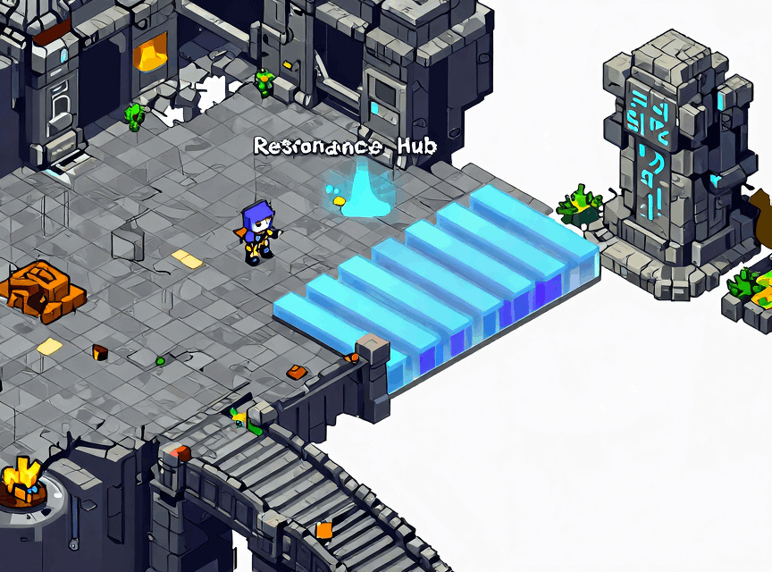

A stylized 16-bit pixel art aesthetic that blends natural environments and ancient ruins with luminous, spectral Echoes. The
world is grounded and organic, while memories of the past appear as soft, glowing manifestations layered over reality.

### Aesthetic: “Faded Past, Living Echoes”

The present world is weathered and subdued—stone is cracked, paths are worn, and structures feel aged and incomplete.
In contrast, Echoes appear as translucent, glowing blue forms, representing moments preserved in time. These Echoes feel alive,
gently pulsing and shifting, as if the past is trying to resurface.

### Color Palette

●

**Present World:**

Muted earth tones—greens, browns, soft greys, and faded stone
●

**Echo Layer:**

Cool luminous hues—cyan, soft blue, and pale teal
●

**The Hush:**

Desaturated greys and stark void-like tones that remove color and detail

**This palette creates a clear visual distinction between:**
●
what exists now
●
what once was
●
what is being erased

### Core Principles

- Dual-Layer Visual Identity

**Every environment exists in two states:**
●
The present (natural, worn, grounded)
●
The echoed past (cleaner, brighter, semi-transparent)
These layers overlap visually, allowing players to instantly recognize when they are interacting with memory.
- Organic Meets Ethereal
●
Environments: natural, textured, imperfect
●
Echoes: smooth, glowing, slightly animated
This contrast reinforces the idea that Echoes are not part of the physical world, but something lingering just beyond it.
- Clarity Through Contrast
Echo objects, interactables, and puzzle elements should always be:
●
visually distinct (glow, color, subtle animation)
●
readable at a glance
This ensures players always understand: �
� “this is something I can interact with using Echo mechanics”
- The Hush as Absence
The Hush is represented not by detail—but by its removal.
●
Faded or erased textures
●
Loss of color
●
Flattened, lifeless surfaces
It should feel like the world is being forgotten in real time

### Subtle Motion, Echoing Presence

Animation in Echoes of the Valeemphasizes clarity, responsiveness, and a sense of lingering motion—reinforcing the game’s
themes of memory and time. Movements are smooth and readable, with subtle stylization that reflects the presence of the
Luminous Weave.

### 🧍 Character Animation

### Movement

●
4-directional or 8-directional movement (depending on final implementation)
●
Smooth transitions between idle, walk, and action states
●
Slight easing to give movement a natural but responsive feel
- Priority:

**Player control should always feel immediate and precise**

### Idle Animation

●
Subtle breathing or shifting stance
●
Light ambient motion (cloth, hair, glow effects)
●
Occasional small variations to prevent stiffness
- Purpose:
Keep the character feeling alive even when still

### Interaction Animations

●
Quick, readable gestures (activate, push, interact)
●
Minimal wind-up to maintain responsiveness
●
Clear visual distinction between actions
- Echo Animation (Core Feature)
Echoes should feel like temporal afterimages, not clones.
●
Slight transparency or glow
●
Smooth but slightly “offset” motion
●
Trail or ghosting effect during movement

### Playback Behavior

●
Animations match recorded input exactly
●
No interpolation beyond what was recorded
●
Loop or terminate cleanly at the end of playback
- Key Feeling:

**Echoes should feel like memories replaying, not living entities**

- Enemy Animation
●
Simple but readable movement patterns
●
Slight distortion or instability for Hush-based enemies
●
Animation should communicate behavior clearly (danger, movement, disruption)

### Hush Influence

●
Flickering
●
Warping
●
Fragmented motion
- Enemies should feel unnatural and unstable
- Environmental Animation
●

**Subtle ambient motion:**
◯
Grass swaying
◯
Light flickering
◯
Particles drifting
●
Echo-reactive elements animate when influenced
- Purpose:
Make the world feel alive and reactive
- Animation Timing & Feel
●
Fast response time for player inputs
●
Consistent timing across all animations
●
Avoid long delays or heavy anticipation
- Rule:

**Gameplay clarity over realism**

- Visual Feedback Through Animation

**Animation is used to communicate:**
●
Successful interaction
●
Echo activation
●
Puzzle completion
●
Environmental changes
- Players should feel what happened without needing UI
- Looping & Repetition
●
Loops should be seamless and unobtrusive
●
Avoid noticeable snapping or resets
●
Echo loops must remain perfectly consistent
- Design Philosophy
●

**Animations should support gameplay, not distract from it**

●

**Every motion must be:**
◯
Readable
◯
Intentional
◯
Consistent

### Echoes in Sound

Audio in Echoes of the Valeis deeply tied to memory, time, and the Luminous Weave. Sound is used not only to create
atmosphere, but also to reinforce gameplay mechanics, guide the player, and reflect the state of the world.
The overall tone is ambient, emotional, and reactive, with subtle layers that evolve as the player restores the Vale.
- Music Direction

### Core Tone

●
Ambient, melodic, and atmospheric
●
Minimalist compositions with evolving layers
●
Soft instruments blended with synthetic textures

**Inspiration:**

●
Breath of the Wild (ambient exploration)
●
Hollow Knight (emotional undertones)

### Dynamic Music System

**Music should adapt based on:**
●
Player location
●
Presence of the Hush
●
Puzzle engagement
●
Restoration progress

**Examples:**

●
Calm exploration → light ambient tones
●
Puzzle solving → subtle rhythmic layers added
●
Hush zones → distorted, dissonant audio
- Music becomes a feedback system, not just background
- Echo Audio Design (CORE FEATURE)
Echoes should have a distinct sonic identity.

### Recording

●
Soft “capture” sound
●
Subtle temporal distortion or rewind effect

### Playback

●
Slightly muffled or filtered version of player actions
●
Faint echo/reverb trail
●
Layered duplication effect

### Echo Presence

●
Low ambient hum when Echo is active
●
Pitch or intensity may scale with upgrades
- Players should hear Echoes as much as they see them
- Hush Audio Design
The Hush should feel oppressive and unnatural.
●
Low-frequency rumble
●
Audio distortion/glitching
●
Sudden drop-offs in ambient sound

**Behavior:**

●
Dampens or distorts Echo sounds
●
Creates tension through silence and instability
- Silence is just as important as sound here
- Environmental Audio
●
Wind, rustling grass, distant echoes
●
Subtle spatial audio cues
●
Ambient loops that evolve with the environment

**Reactive Elements:**

●
Objects emit sound when influenced by Echoes
●
Restored areas sound fuller and more alive
- Enemy Audio
●
Minimal but distinct audio signatures
●

**Sound communicates:**
◯
Movement
◯
Threat level
◯
Behavior

**Hush-Based Enemies:**

●
Warped, glitchy, unstable sounds
●
Non-natural tonal qualities
- Audio as Gameplay Feedback

**Sound should communicate:**
●
Successful interactions
●
Echo activation and completion
●
Puzzle progress
●
Danger (Hush presence, enemy proximity)
- Players should often understand what happened without looking at UI
- Mixing & Clarity
●
Avoid overwhelming the player with too many layers
●
Prioritize important sounds (Echo, interaction, danger)
●
Maintain a clean and readable audio space
- Design Philosophy
●
Audio is diegetic where possible (exists within the world)
●

**Every sound should serve:**
◯
Atmosphere
◯
Feedback
◯
Emotional tone

### Clarity Through Subtlety

The UI in Echoes of the Valeis designed to be minimal and unobtrusive, allowing players to remain immersed in the world while
still receiving clear, meaningful feedback.
Information is conveyed through a combination of visual cues, animation, audio, and subtle UI elements, rather than heavy
overlays or persistent HUD clutter.
- Core UI Principles
●
Minimal HUD – Only essential information is displayed
●
Diegetic feedback – Wherever possible, feedback exists within the world
●
Clarity over complexity – Players should immediately understand what is happening
●
Consistency – Visual language remains uniform across all systems
- Echo System UI (CORE FEATURE)
This is the most critical UX element in your game.

### Recording State

●
Subtle indicator when recording begins (icon + visual effect)
●
Timer or visual bar showing remaining duration
●
Environmental tint or glow to reinforce active recording

### Playback State

●
Clear visual distinction between player and Echo
●
Playback progress indicator (subtle timeline or fade)
●
End-of-playback feedback (sound + visual dissolve)

### Echo Capacity

●

**Small UI element showing:**
◯
Number of active Echoes
◯
Remaining available slots
- Keep this small and non-intrusive
- Player Feedback UI
●
Interaction prompts (e.g., “Press E”) appear contextually
●

**Visual feedback for:**
◯
Successful interaction
◯
Failed interaction
◯
Puzzle completion
- Feedback should feel instant and satisfying
- Hush Feedback
●
Screen distortion or vignette effect
●
Subtle UI corruption/glitch effects
●
Reduced clarity of Echo indicators
- The UI itself should feel affected by the Hush

### 🗺️ Menus & Navigation

### Pause Menu

●
Resume
●
Settings
●
Exit
Simple and clean—no unnecessary complexity

### Inventory / Collection (if used)

●
Memory Fragments
●
Key narrative objects
Minimal text, strong visual representation
- Visual Style
●
Soft glows and subtle gradients
●
Clean, readable typography
●

**Limited color palette aligned with:**
◯
Echo (cool tones / glow)
◯
Hush (dark, distorted tones)
- UX Design Philosophy
●
The player should rarely ask: �
� “What just happened?”
●

**Instead, they should intuitively understand through:**
◯
Motion
◯
Sound
◯
Visual feedback
- Feedback Loops

**Every player action should result in:**
1. Immediate visual response
2. Supporting audio cue
3. Optional subtle UI confirmation
- This reinforces learning without tutorials
- Controller & Input UX
●
All actions should be easily accessible
●
Minimal button combinations
●
Consistent mapping across gameplay

### Simple, Responsive, and Readable

Controls in Echoes of the Valeare designed to feel intuitive and immediate, allowing players to focus on exploration, puzzle-
solving, and Echo interaction without unnecessary complexity.

**The control scheme prioritizes:**
●
quick movement
●
clear interaction
●
easy access to Echo mechanics
●
minimal button combinations

### Core Actions

### Movement

●
Move Soren in all directions using keyboard or controller input
●
Movement should feel responsive and precise

### Interact

●

**Used to:**
◯
talk to NPCs
◯
activate switches
◯
inspect objects
◯
use Echo Points
This should be the primary context-sensitive action button.

### Record Echo

●
Begins recording Soren’s movement and interactions at an Echo Point
●
Clearly enters the player into Echo recording mode

### Play Echo

●
Replays the currently recorded Echo
●
Used to perform actions alongside Soren

### Cancel / Reset Echo

●
Stops active playback or clears the current Echo recording
●
Useful for retrying puzzles quickly

### Pause

●
Opens the pause menu and settings

### Recommended Keyboard Layout

### Keyboard

●
WASD — Move
●
E — Interact
●
Q — Record Echo
●
R — Play Echo
●
F — Cancel / Reset Echo
●
Esc — Pause

### Recommended Controller Layout

### Controller

●

**Left Stick / D-Pad — Move**

●

**South Button (A / Cross) — Interact**

●

**Left Shoulder (LB / L1) — Record Echo**

●

**Right Shoulder (RB / R1) — Play Echo**

●
West Button (X / Square) — Cancel / Reset Echo
●

**Start / Menu — Pause**

### Control Design Principles

●
Actions should require as few button presses as possible
●
Echo actions should be easy to reach without awkward hand movement
●
Context-sensitive interaction reduces button overload
●
Puzzle retry actions should be quick and frustration-free

### Future Input Support

**Controls should be designed to support:**
●
keyboard and mouse
●
gamepad
●
rebinding options later if needed

### UX Considerations

●
Input response should feel immediate
●
Echo actions should always provide clear feedback
●
Repeated puzzle attempts should not require excessive menu navigation

### Learning Through Echoes

Echoes of the Valeintroduces its mechanics through environmental interaction and guided discovery, allowing players to learn
by doing rather than being told. The onboarding experience is seamlessly integrated into the opening area, ensuring that
learning feels like part of the world.
- Opening Environment (Village)

**The game begins in a calm, safe environment:**
●
No enemies
●
Minimal UI
●
Open space to explore

**Purpose:**

●
Teach movement and interaction
●
Establish tone and atmosphere
●
Build curiosity
- Stage 1: Basic Movement & Interaction

**What the player learns:**

●
Movement controls
●
Interacting with objects and NPCs

**How it’s taught:**

●
A villager or object subtly prompts interaction
●
A simple obstacle (e.g., a blocked path or object to inspect)
- No explicit instructions—just natural guidance
- Stage 2: First Echo Discovery
The player encounters an Echo Point.

**Trigger:**

●
Interaction causes a brief visual/audio shift
●
The world subtly reacts

**What the player learns:**

●
Something unusual is happening
●
The environment can change
- This builds mystery before explanation
- Stage 3: Echo Recording
The player is guided to record their first Echo.

**Teaching Method:**

●
A simple situation where recording is clearly useful
●
Minimal UI prompt appears (e.g., “Record”)

**Example Setup:**

●
A pressure plate that must be held
●
The player steps on it, then steps off and sees the door close
- Encourages experimentation
- Stage 4: Echo Playback
The player learns to replay their Echo.

**Outcome:**

●
The Echo holds the pressure plate
●
The player can now move forward
- First “aha” moment
- Stage 5: Reinforcement Puzzle

**A slightly more complex puzzle reinforces learning:**
●

**Requires:**
◯
Better timing
◯
Slight planning
- Ensures the mechanic is understood before moving on
- Stage 6: Guided Exit

**The player is subtly directed toward the next area:**
●
Visual cues (path, lighting, landmarks)
●
Minimal dialogue or environmental hints
- Teaching Philosophy
●

**Show, don’t tell**

●
Introduce one concept at a time
●
Reinforce through repetition
●
Avoid interrupting gameplay flow
- UI & Prompt Usage
●
Contextual prompts only when needed
●
Fade in/out quickly
●
Never block the screen
- UI supports learning, not replaces it
- Failure-Friendly Design
●
No punishment during onboarding
●
Quick retry for puzzles
●
Immediate feedback on mistakes
- Encourages experimentation without frustration
- Emotional Goal

**The onboarding experience should make the player feel:**
●
Curious
●
Capable
●
Intrigued by the world

### Inclusive Through Clarity

Echoes of the Valeis designed to be accessible through clear visual communication, flexible controls, and customizable player
experiences. Accessibility options ensure that players of varying abilities can fully engage with the game’s mechanics,
atmosphere, and story.
- Visual Accessibility

### Color & Contrast

●
Avoid reliance on color alone to convey information
●

**Echo and Hush effects use:**
◯
color
◯
brightness
◯
animation
- Example:
Echo = glow + motion
Hush = distortion + flicker

### Colorblind Support (Future Option)

●

**Alternate color palettes for:**
◯
Echo effects
◯
Hush effects
●
Maintain strong contrast between interactive elements

### Screen Effects Control

●

**Option to reduce or disable:**
◯
screen distortion (Hush effects)
◯
motion blur
◯
flashing effects
- Important for:
●
motion sensitivity
●
photosensitivity
- Audio Accessibility

### Subtitles

●
All dialogue and important audio cues supported by subtitles
●

**Adjustable:**
◯
size
◯
background opacity

### Audio Mix Controls

●

**Separate sliders for:**
◯
music
◯
sound effects
◯
ambient audio

### Visual Audio Feedback

●
Important audio events (Echo activation, danger) also supported visually
●
Ensures players are not reliant on sound alone
- Control Accessibility

### Rebinding (Future-Friendly)

●
Allow players to remap controls
●
Support both keyboard and controller

### Simplified Inputs

●
Avoid complex button combinations
●

**One-button actions for:**
◯
interact
◯
record
◯
playback

### Input Responsiveness

●
Immediate feedback on input
●
No tight timing windows required early on
- Cognitive Accessibility

### Clear Feedback

●

**Actions always produce:**
◯
visual response
◯
audio cue
●
Players can understand outcomes without confusion

### Puzzle Clarity

●

**Puzzles are:**
◯
logical
◯
consistent
◯
based on learned rules

### Optional Hint System (Future Option)

●
Subtle hints for stuck players
●

**Could be delivered through:**
◯
NPC dialogue
◯
environmental cues
- Gameplay Accessibility

### Low Punishment Design

●
Frequent checkpoints (Echo Sites)
●
Quick retry on failure
●
No major loss of progress

### Adjustable Difficulty (Optional)

●
Reduce Hush intensity
●
Increase Echo duration
●
Extend puzzle timing windows
- UI Accessibility
●
Clean, minimal UI
●
Scalable text size (future option)
●
High readability fonts
- Design Philosophy
●
Accessibility is built into the core design, not added later
●

**Systems are:**
◯
consistent
◯
readable
◯
predictable
- If players understand the rules, they can succeed

### Built for Clarity and Performance

Echoes of the Valeis developed using a structured, modular approach to ensure maintainability, scalability, and consistent
performance. Systems are designed to be lightweight, predictable, and easy to expand as the project grows.
- Engine & Tools
●
Engine: Unity (Unity 6 / 6000.x)
●
Rendering Pipeline: Universal Render Pipeline (URP)
●

**Scripting Language: C#**

●
IDE: JetBrains Rider
- Target Platform
●
Primary Platform: PC (Windows & Linux)
●
Resolution Target: 1920 × 1080 (1080p)
●

**Aspect Ratio: 16:9**

- Design scales down later if needed
- Input System
●

**Unity Input System (New Input System)**

●

**Supports:**
◯
Keyboard & Mouse
◯
Gamepad
- Core Systems Architecture

### Player System

PlayerController
├── Movement
├── Interaction
├── Input Handling

### Echo System

EchoSystem
├── Record()
├── Playback()
├── Clear()

### Puzzle System

PuzzleSystem
├── Activate()
├── Reset()
├── Validate()

### Game State

GameManager
├── Respawn()
├── SaveCheckpoint()
├── LoadLevel()

### 🗺️ Level & World Structure

●
Tile Size: 16 × 16 pixels
●
Tilemap System: Unity Tilemap

Created using More info at ludo.ai

---

### Level Organization

●
Each area uses LevelData (ScriptableObject)
●

**Levels are built using:**
◯
Prefabs
◯
Tilemaps
◯
Serialized placement data
- Matches your current workflow perfectly 👀
- Graphics & Assets
●
Art Style: Pixel Art
●
Sprites: Imported with consistent Pixels Per Unit (PPU)
●
Lighting: URP 2D Lighting
- Performance Targets
●

**Stable 60 FPS**

●
Lightweight systems (no heavy physics reliance)
●
Minimal runtime allocations where possible
- Data & Serialization
●

**Use ScriptableObjects for:**
◯
LevelData
◯
Configurations
◯
Shared systems
●

**Runtime data handled via:**
◯
Managers (GameManager, PuzzleManager, etc.)
- Audio System
●
Centralized AudioManager
●

**Supports:**
◯
SFX
◯
Music
◯
Dynamic audio states
- Code Architecture Principles
●
Modular systems (separation of concerns)
●
Avoid tight coupling between systems
●

**Systems communicate via:**
◯
Events
◯
References (when appropriate)
- Debug & Development Tools (Optional but Recommended)
●
Debug UI toggle
●

**Ability to:**
◯
Reset puzzles
◯
Reload level
◯
Toggle Echo states
- Project Structure (Recommended)
Scripts/
├── Core/
├── Player/
├── Echo/
├── Puzzle/
├── World/
├── UI/
Art/
├── Sprites/
├── Tilesets/
Data/
├── LevelData/
├── Config/
- Keeps everything clean as your project grows

Created using More info at ludo.ai

---
